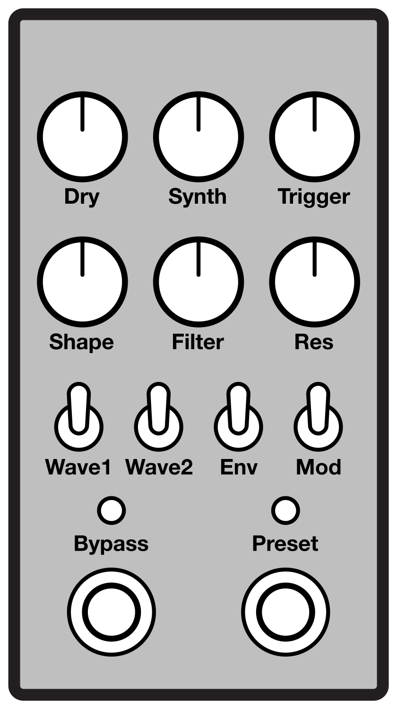

# SynthPedal

This is firmware for a pitch-tracking synthesizer effect pedal. It runs on an
[Electro-Smith Daisy Seed](https://www.electro-smith.com/daisy/daisy) mounted
in a [PedalPCB Terrarium](https://www.pedalpcb.com/product/pcb351/).

## Controls

### Knobs

#### Dry
Sets the output level of the dry signal.  Unity gain at center.

#### Synth
Sets the output level of the synth signal.

#### Trigger
Sets the trigger threshold for the synth.

#### Shape
Controls a parameter of the generated wave:

- **Pulse:**  Duty cycle. Square wave at minimum.
- **Triangle:**  Skew. Triangle wave at minimum, sawtooth wave at maximum.
- **Noise:**  Pitch offset.

#### Filter
- **Left:** low-pass frequency
- **Center:** no filter
- **Right:** high-pass frequency

#### Res (Resonance)
Boosts the signal at the active filter's corner frequency.

### Toggle Switches

#### Wave1, Wave2
Selects the synth oscillator type:

- **↓↓:** Triangle wave
- **↓↑:** Pulse wave
- **↑↑:** Nothing yet...
- **↑↓:** Noise

#### Env (Envelope)
Selects the synth envelope:

- **↑:** Copy dry envelope
- **↓:** Fixed/none

#### Mod (Modulate)
Selects the preset function:

- **↑:** Modulate
- **↓:** Toggle

### Foot Switches and LEDs

#### Bypass
Enables and disables the pedal. The LED is lit when the pedal is active.

#### Preset
When the preset foot switch is held for more than one second, the LED will
blink three times, and the current control settings will be saved. The stored
settings include all knobs except **Trigger**, and all toggle switches except
**Mod**.

When the **Mod** switch is set to ↓ (Toggle), the foot switch selects between
the current control settings (LED off) and the saved preset (LED on).

When the **Mod** switch is set to ↑ (Modulate), the preset LED will flash at
the current modulation rate. Each note played will blend over time from the
saved preset to the current control settings. The modulation rate is set via
tap tempo using the preset foot switch.

## Building

    cmake \
        -GNinja \
        -DTOOLCHAIN_PREFIX=/path/to/toolchain \
        -DCMAKE_TOOLCHAIN_FILE=lib/libDaisy/cmake/toolchains/stm32h750xx.cmake \
        -DCMAKE_BUILD_TYPE=Release \
        -B build .
    cmake --build build
